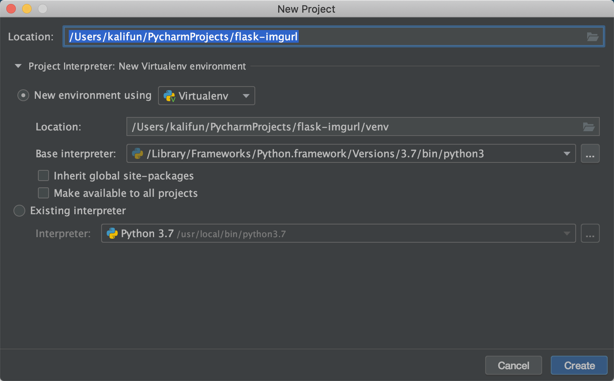

# 第一个flask应用
> flask就不过多介绍了，可以进入[官网](https://dormousehole.readthedocs.io/en/latest/)进行基础学习。
## 环境
- Python: > 3
- IDE: Pycharm
## 创建项目
Tip:之所以选择pycharm是在创建项目时可以创建虚拟环境。就不需要手动敲命令来创建激活虚拟环境了。

## 安装库
1.在终端安装
2.在IDE安装
```
pip install flask  
```

前面我们配置好了虚拟环境，所以只要环境是激活状态，我们就不需要担心我们安装的库都到系统环境中了。

## 快速入手

```python
# 引入flask
from flask import Flask

# app是Flask的实例，它接收包或者模块的名字作为参数，但一般都是传递__name__
app = Flask(__name__)

# 使用app.route装饰器会将URL和执行的视图函数的关系保存到app.url_map属性上。
@app.route("/",methods=['GET'])
def index():
    return "Hello world"

if __name__ == '__main__':
    # app.run启动服务。默认Flask只监localhost这个地址，端口为5000。
    app.run()
```

```
$ curl http://127.0.0.1:5000
Hello world
```

